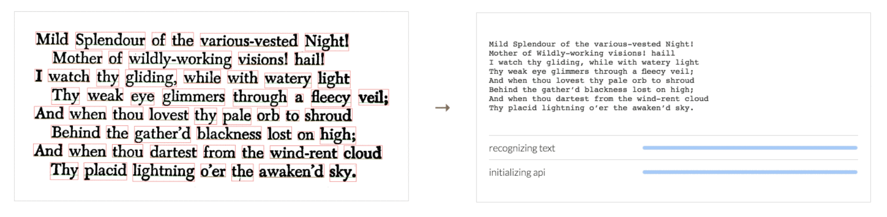

## Running the Code
The gif above is tesseract.js at work. It is scanning an image available online and it outputs text into a new div, for my purposes it will be an invisible paragraph tag. This gif is from the port's [repo](https://github.com/naptha/tesseract.js#tesseractjs) on [Github](https://www.github.com) and that is what I need to accomplish and have it perform in any page the extension is activated on. The project is as I've said to myself and to others, not overly challenging...I'm sure I will come to regret spreading that inaccuracy (I already do, hence the title of the next section). Nevertheless, I've decided to run with that assumption as it now effortlessly rolls out of my mouth whenever I'm discussing the project. To be fair I've only been stating this because Tesseract is doing the heavy lifting after all; there are numerous lines of code that make up the [API] that regardless of the accuracy of the output (not always very good), it still is in my opinion a little bit of code magic! Yes, OCR scanning has been around for ages, it's not machine learning, AI, a self driving car or anything hot and trendy but it is still a cool thing.

How's does it work? Simply include the [CDN](https://cdn.rawgit.com/naptha/tesseract.js/1.0.10/dist/tesseract.js) in script tags within the head of your HTML and add the bit of JavaScript below into another set of script tags and you're off...almost.
    
I went through these steps and nothing happened. I attempted to have the scanned text print to the console, pop up as an alert window, add it to the DOM, still nothing. Mild panic ensued as I realize I wasn't going to be ready for a demo I committed myself to.

## Problem Encountered
It turns out that running the code snippet above does not do the trick. There is a problem with this snippet that is not (to my knowledge) covered within the Tesseract documentation. I'll need to look through the issues some more. The problem, I came to realize is that Tesseract.js loads every image into a canvas tag prior to processing but if that image does not meet [CORS](https://developer.mozilla.org/en-US/docs/Web/HTML/CORS_enabled_image) approval, the canvas tag immediately becomes "tainted" and any processing or pulling of data stops, end of the line. Errors arise in the console which are not initially welcomed but after the frustration subsides and a bit of calm settles in I can put them to use.

## Promising Solution
A solution indeed thanks to some research and the awesome [MDN](https://developer.mozilla.org/en-US/) documentation. As I mentioned above the canvas tag was becoming tainted, which returned an error. How to prevent the canvas tag from getting tainted? Create a new canvas tag, change the [crossOrigin attribute](https://developer.mozilla.org/en-US/docs/Web/HTML/Element/img#attr-crossorigin) of the image and set it to "anonymous". Refresh that page, check the console and voila, text from the image is printed on to the console.

## Next steps
Well, I have another demo this week. It's a brief demo showing the capabilities of tesseract, the potential use for a particular team within [Firefox](https://en.wikipedia.org/wiki/Firefox) and the direction of my extension but the pressure is on regardless of brevity. The code is running and doing what I need it to do but I am still using the CDN and in the amount of time I have left I'd like to set it up so that I can do the demo with the local files. Stay tuned...
